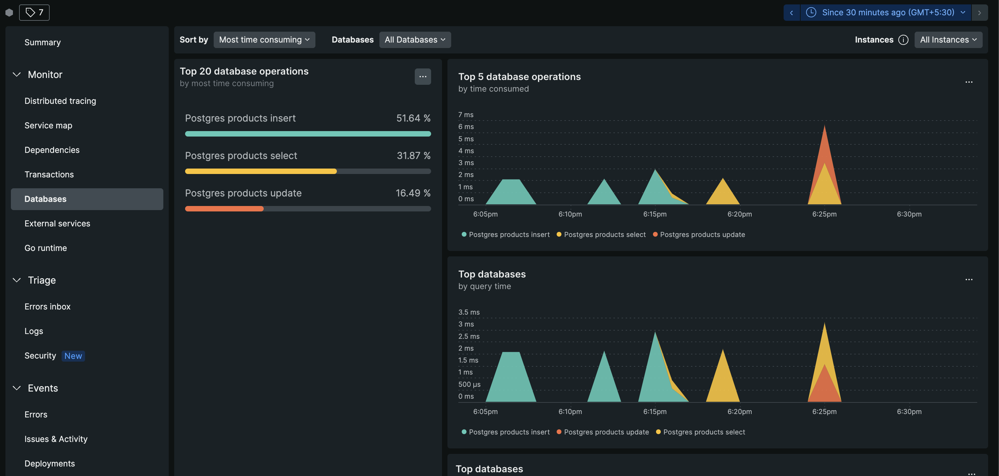

# Track Postgres Queries in Go Application using Newrelic

This is a simple example of how to track Postgres queries in Go application using Newrelic.

## How to run

1. Clone this repository
2. Run `go run main.go`
3. Create a newrelic account and get your license key
4. Create a table in your Postgres database

```sql
CREATE TABLE product (
    price bigint,
    deleted_at timestamp with time zone,
    created_at timestamp with time zone,
    updated_at timestamp with time zone,
    code text UNIQUE UNIQUE,
    id SERIAL PRIMARY KEY
);
```

5. Update newrelic license and dns in `main.go`
6. Open POSTMAN to test the API
7. Send a POST request to `http://localhost:3000/products/` with the following body:

```json
{
  "code": "123",
  "price": 1000
}
```

Other supported APIs:

- GET `http://localhost:3000/products/`
- GET `http://localhost:3000/products/:id`
- PATCH `http://localhost:3000/products/:id`
- DELETE `http://localhost:3000/products/:id`

## Output in Newrelic



## Reference

- [Monitoring your Go database with New Relic](https://newrelic.com/blog/how-to-relic/monitoring-gorm)
